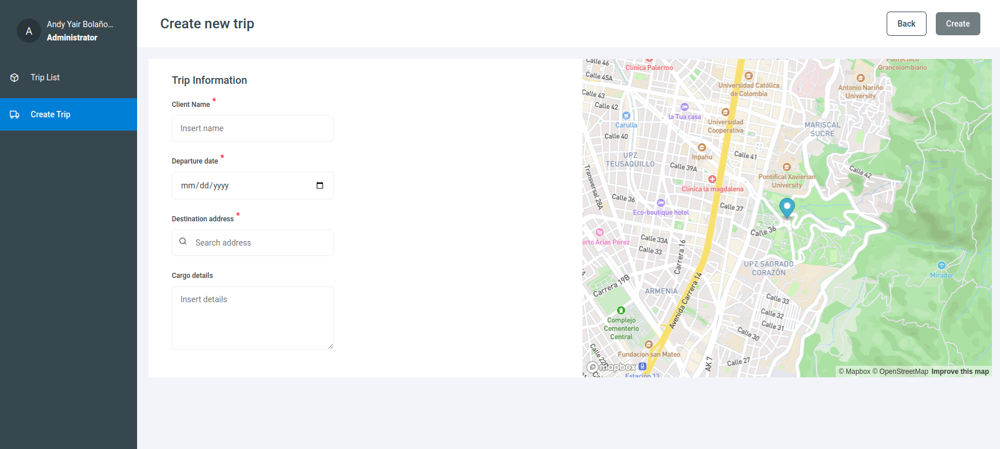

# Sol Ecosystem

## Table of Contents
1. [General Info](#general-info)
2. [Technologies](#technologies)
3. [Installation for Development](#Installation-for-Development)
3. [Installation with docker image](#Installation-with-docker-image)

## General Info
The "SOL Ecosystem" project arises as an initiative to efficiently and collaboratively integrate several independent projects, each developed as a *microfrontend using Vue 3*. The integration is done through the powerful technology of *Module Federation*, allowing the construction of a comprehensive system for the management of shipping logistics.


continuous deployment was implemented for each project using [netlify](https://www.netlify.com/)

## Main Components:

### 1. Sol Server
It functions as the centralized source of data for the ecosystem, providing the necessary information for efficient shipment management. This is only a server for testing purposes, it is developed with JSON-Server. to see more please visit the [Repository](https://github.com/andybolano/sol-server).

### 2. UI Sol Shared Library:
Contains shared user interface (UI) components that ensure consistency and visual coherence across all microfrontends of the system. Facilitates agile development and uniform interface updates. [View Project](https://github.com/andybolano/sol-shared-library).

### 3. Sol Trip Management:
This microfrontend specializes in trip management, offering a complete listing where users can view, create and edit trips. It provides an intuitive interface to optimize shipment-related operations. [View Project](https://github.com/andybolano/sol-tripManagement).

### 4. Shell:
Acts as the integrating layer of the project, combining the different microfrontends in a harmonious way. Provides a cohesive user experience by combining the functionalities of the different independent projects. [View Project](https://github.com/andybolano/shell/).

### 5. Sol Ecosystem:
The central project that brings together and coordinates all integrated repositories. It represents the culmination of integration, offering a complete and robust system for the efficient management of shipping logistics.

With the SOL Ecosystem project, we seek to optimize shipment logistics management by leveraging the modularity of microfrontends and the seamless integration between them. This approach not only improves development efficiency, but also provides a consistent and engaging user experience.


🔵 View project running: [sol-shell](https://sol-shell.netlify.app/)



#### Important 📢:
you should know that this project is using the **microfrontend architecture**, making use of an external project called [sol-trip-management](https://sol-trip-management.netlify.app/#/trip/list) to load the trip module.

Here you can see a small scheme to better understand the architecture of this project.


In order to run this project in your local environment you must follow steps:

1. Installation UI sol-shared-library [installation instructions](https://github.com/andybolano/sol-shared-library) 

2. Installation sol-trip-management [installation instructions](https://github.com/andybolano/sol-tripManagement) 

2. Test server [installation instructions](https://github.com/andybolano/sol-server) 

## Technologies
A list of technologies used within the project:
* [VueJS](https://vuejs.org/): Version 3.2.13 
* [Webpack](https://webpack.js.org/): Version 5.89.0
* [Node.js](https://nodejs.org/): Version 16.0.0

## Installation for Development
#### Clone project
with this instruction all the projects that are part of the ecosystem will be cloned recursively.
```
git clone --recursive https://github.com/andybolano/sol-ecosystem.git
```

#### 📁 Move to the project directory 
```
cd sol-ecosystem
```

#### 🛠️ Install dependencies
This command will install the dependencies for all projects.
```
./install_all.sh
```

#### 🏁 Compiles and hot-reloads for development
#### Important 📢: you must go into each of the projects and execute the following command.

```
npm run serve
```

The entire project is configured by default to run on **port 8080**, so you should view it at the following address on your computer [http://localhost:8080/](http://localhost:8080/) 🏁.

you can also view the projects independently.

* 1. Sol-serve [http://localhost:3000/](http://localhost:3000/)
* 2. Sol-shared-library [http://localhost:8081/](http://localhost:8081/)
* 3. Sol-trip-management [http://localhost:8082/](http://localhost:8082/)
* 4. Sol-shell [http://localhost:8080/](http://localhost:8080/)

## Installation with docker image 🐋

```
$ git clone --recursive https://github.com/andybolano/sol-ecosystem.git
$ ./start-all.sh
```
if you are using linux environment and you have permissions problems when executing the command ./start-all.sh
```
chmod +x start-all.sh
```

The project is configured by default to run on **port 8080**, so you should view it at the following address on your computer [http://localhost:8080/](http://localhost:8080/) 🏁.
